# 02 - System Architecture

**Document:** Technical Architecture - System Overview  
**Version:** 1.0  
**Last Updated:** 2025-11-04

---

## Technology Stack Summary

### Backend (Render.com)
- **Framework**: NestJS (TypeScript)
- **Database**: NeonDB (PostgreSQL 16 + pg_vector extension)
- **Cache**: Render Redis
- **Queue**: BullMQ (Redis-backed)
- **Authentication**: Neon Auth (JWT)
- **Real-time**: Pusher (WebSocket)
- **File Storage**: Cloudflare R2 (S3-compatible)

### Client (Electron Desktop App)
- **Shell**: Electron 28+
- **UI Framework**: Next.js 14 (Static Export)
- **UI Library**: React 18 + Tailwind CSS
- **State Management**: Zustand
- **Local Database**: SQLite with sqlcipher (AES-256)
- **WhatsApp Automation**: Puppeteer/Playwright

### AI Layer
- **Primary Provider**: Bytez.com
- **Fallback Providers**: OpenRouter, Groq, Gemini
- **BYOK Integration**: Puter.js
- **Embedding Model**: OpenAI ada-002 (1536 dimensions)

---

## C1: System Context Diagram

```mermaid
graph TB
    User[👤 WAXOS User<br/>Owner/Admin/Staff]
    WAXOS[🖥️ WAXOS Platform<br/>Hybrid Cloud-Client SaaS]
    WhatsApp[📱 WhatsApp Web<br/>Meta Platform]
    Google[🔗 Google Workspace<br/>Gmail/Calendar/Drive]
    Microsoft[🔗 Microsoft 365<br/>Outlook/Teams]
    Marketplaces[🛒 E-commerce Platforms<br/>Shopify/WooCommerce]
    AICloud[🤖 AI Provider Cloud<br/>Bytez/OpenRouter/Groq/Gemini]
    StripeIdentity[🔐 Stripe Identity<br/>KYC Verification]
    
    User -->|Uses Desktop App| WAXOS
    WAXOS -->|Automates via Browser| WhatsApp
    WAXOS -->|Integrates Calendar/Email| Google
    WAXOS -->|Integrates Calendar/Email| Microsoft
    WAXOS -->|Syncs Orders & Products| Marketplaces
    WAXOS -->|AI Requests via AAL| AICloud
    WAXOS -->|Voice Clone Verification| StripeIdentity
```



**Key External Dependencies:**
- **WhatsApp Web**: Core automation target (**HIGH RISK** - ToS violation)
- **AI Providers**: Mission-critical for M4, M7, M15 features
- **Stripe Identity**: Required for M4 voice cloning (regulatory compliance)
- **Google/Microsoft**: Optional integrations for M12 (marketing automation)
- **Marketplaces**: Optional for M11 (e-commerce sync)

---

## C2: Container Diagram

```mermaid
graph TB
    User[👤 User]
    
    subgraph Client["💻 Electron Desktop App"]
        NextUI[⚛️ Next.js Static UI<br/>React + Tailwind CSS]
        LocalDB[🗄️ SQLite + sqlcipher<br/>Encrypted Local Storage]
        PuterJS[🔌 Puter.js Library<br/>BYOK AI Client]
        WhatsAppBrowser[🌐 Embedded Browser<br/>Puppeteer/Playwright]
    end
    
    subgraph Cloud["☁️ Render.com Backend"]
        API[🔧 NestJS API<br/>Modular Monolith]
        Worker[⚙️ BullMQ Worker<br/>Background Jobs]
        Redis[(📦 Redis Cache<br/>Session + Queue)]
    end
    
    subgraph Data["💾 Data Layer"]
        NeonDB[(🐘 NeonDB<br/>Postgres + pg_vector)]
        R2[(📁 Cloudflare R2<br/>Object Storage)]
    end
    
    Pusher[⚡ Pusher<br/>WebSocket Real-time]
    NeonAuth[🔐 Neon Auth<br/>JWT Provider]
    AIProviders[🤖 AI Providers<br/>Multi-vendor]
    
    User -->|Interacts| NextUI
    NextUI <-->|IPC Bridge| LocalDB
    NextUI -->|HTTPS API Calls| API
    NextUI <-->|WebSocket Subscribe| Pusher
    NextUI -->|BYOK Mode Only| PuterJS
    WhatsAppBrowser -->|Automation Commands| NextUI
    
    API <-->|SQL Queries| NeonDB
    API -->|File Upload/Download| R2
    API <-->|Cache & Session| Redis
    API -->|Publish Events| Pusher
    API -->|Verify JWT| NeonAuth
    API -->|AI Requests via AAL| AIProviders
    
    Worker <-->|Job Queue| Redis
    Worker <-->|Data Access| NeonDB
    Worker -->|AI Requests via AAL| AIProviders
    
    PuterJS -.->|Direct API Calls<br/>User's API Key| AIProviders
```



---

## Critical Data Flows

### Flow 1: Staff Sends AI-Assisted Reply (SaaS Mode)

```
1. Staff opens chat in Electron UI
2. UI requests chat context from backend API
   → GET /api/v1/chats/:id/context
3. Backend fetches last 10 messages from NeonDB
4. Backend performs vector search in knowledge_vectors (top 3 articles)
5. Backend calls AAL.generateReply(context + KB articles)
6. AAL routes to Bytez (primary provider)
7. Bytez returns AI suggestion
8. Backend logs interaction in ai_interactions table
9. Backend returns suggestion to UI
10. Staff reviews, edits, and clicks "Send"
11. UI optimistically adds message to local state
12. UI sends message to backend API
    → POST /api/v1/chats/:id/messages
13. Backend stores message in NeonDB
14. Backend publishes Pusher event "message.new"
15. Backend triggers WhatsApp automation (Electron main process via IPC)
16. WhatsApp automation applies humanization (typing simulation, delays)
17. Message sent via WhatsApp Web
18. Delivery status synced back to NeonDB
19. Pusher event updates message status in UI
```

**Performance Target:** <2 seconds from chat open to AI suggestion displayed

---

### Flow 2: BYOK Mode (Owner Uses Own OpenAI Key)

```
1. Owner enables BYOK in Settings
2. UI prompts for API key (modal)
3. Owner pastes OpenAI key
4. UI encrypts key using master password (AES-256-GCM)
5. UI stores encrypted key in local SQLite (sqlcipher)
6. Owner opens chat
7. UI fetches chat context from local cache (if available) or backend
8. UI calls Puter.js directly (client-side AI request)
   → Puter.ai.chat.create({ messages: context, apiKey: decryptedKey })
9. Puter.js makes direct call to OpenAI API
   → POST https://api.openai.com/v1/chat/completions
10. OpenAI bills Owner's account directly
11. OpenAI returns AI response
12. Puter.js returns formatted suggestion to UI
13. UI displays suggestion with "🔑 BYOK Mode" badge
14. UI logs metadata to backend (NO prompts/responses sent)
    → POST /api/v1/ai/byok-usage { provider: "openai", tokensUsed: 156 }
15. Backend logs for analytics only (no PII)
```

**BYOK Benefits:**
- ✅ User controls AI costs directly
- ✅ No PII sent to WAXOS backend
- ✅ Can use latest models immediately
- ✅ Compliance-friendly

**BYOK Risks:**
- ⚠️ User responsible for API key security
- ⚠️ No AAL fallback if provider fails
- ⚠️ WAXOS cannot optimize costs

---

## Deployment Architecture (Render.com)

### Services Configuration

```yaml
# render.yaml (Infrastructure as Code)

services:
  # Main API Server
  - type: web
    name: waxos-api
    env: docker
    plan: pro # $25/month
    region: oregon
    autoDeploy: true
    branch: main
    healthCheckPath: /health
    envVars:
      - key: NODE_ENV
        value: production
      - key: DATABASE_URL
        fromDatabase:
          name: waxos-neondb
          property: connectionString
      - key: REDIS_URL
        fromService:
          name: waxos-redis
          type: redis
          property: connectionString
      - key: NEON_AUTH_SECRET
        sync: false # Secret in Render dashboard
    
  # Background Worker
  - type: worker
    name: waxos-worker
    env: docker
    plan: starter # $7/month
    dockerCommand: npm run start:worker
    envVars: # Same as API
    
  # Redis Cache
  - type: redis
    name: waxos-redis
    plan: starter # $7/month
    maxmemoryPolicy: allkeys-lru
    ipAllowList: []

# External Databases (not in render.yaml)
# - NeonDB: Managed separately at neon.tech
# - Cloudflare R2: Managed at cloudflare.com
```

### Scaling Strategy

**Vertical Scaling (MVP - Q1 2026):**
- API Server: Pro plan (512MB RAM, 0.5 CPU) - $25/month
- Worker: Starter plan (256MB RAM) - $7/month
- Redis: Starter plan (25MB) - $7/month
- **Total Render Cost**: ~$40/month

**Horizontal Scaling (Public Launch - Q2 2026):**
- API Servers: 3× Pro instances behind load balancer
- Workers: 2× Standard instances
- Redis: Pro plan (500MB)
- **Total Render Cost**: ~$150/month

**Enterprise Scaling (v1.2 - Q3 2026):**
- API Servers: 5× Pro Plus instances
- Workers: 4× Standard instances
- Redis: Enterprise plan (2GB)
- **Total Render Cost**: ~$400/month

---

## Security Architecture

### Defense in Depth Layers

**Layer 1: Network Security**
- TLS 1.3 for all HTTPS traffic
- Cloudflare WAF (Web Application Firewall)
- Rate limiting at edge (Cloudflare)
- DDoS protection (Cloudflare)

**Layer 2: API Security**
- JWT token authentication (Neon Auth)
- Token rotation every 24 hours (access token)
- Refresh token rotation (30-day expiry)
- CORS policies (whitelisted origins only)
- CSRF protection (SameSite cookies)

**Layer 3: Database Security**
- PostgreSQL Row-Level Security (RLS) for multi-tenancy
- Encrypted connections (TLS)
- NeonDB at-rest encryption (AES-256)
- No direct database access (API gateway only)
- Prepared statements (SQL injection prevention)

**Layer 4: Application Security**
- Input validation (Zod schemas)
- Output sanitization (DOMPurify for HTML)
- CSP headers (Content Security Policy)
- E2EE for internal notes (AES-256-GCM)
- sqlcipher for local database (AES-256)
- BYOK keys double-encrypted

**Layer 5: Monitoring & Incident Response**
- Real-time security monitoring (Sentry)
- Audit logs for all sensitive operations
- Automated breach detection
- Incident response runbook

---

## Performance Targets

| Metric | Target | Measurement |
|--------|--------|-------------|
| **API Response Time (P95)** | <100ms | Backend API endpoints |
| **AI Suggestion Latency (P95)** | <2s | From chat open to suggestion |
| **Real-time Event Delivery** | <500ms | Pusher message delivery |
| **Document Processing** | <2min | PDF → vectors (10-page doc) |
| **Database Query Time (P95)** | <50ms | NeonDB queries |
| **WhatsApp Message Send** | <5s | Including humanization delays |
| **Electron App Startup** | <3s | Cold start to UI ready |

---

## Disaster Recovery Plan

### Backup Strategy

**NeonDB Backups:**
- Automated daily backups (retained 30 days)
- Point-in-time recovery (PITR) available
- Manual backup before major migrations
- Backup storage: Neon's S3 buckets

**Cloudflare R2 Backups:**
- Versioning enabled on all buckets
- Cross-region replication (US-West → US-East)
- 30-day retention for deleted objects

**Redis Backups:**
- Redis persistence (RDB + AOF)
- Daily snapshots to S3 (via Render)
- 7-day retention

### Recovery Procedures

**Scenario 1: API Server Failure**
- Render auto-restarts container (<1 minute downtime)
- If persistent failure: Deploy to backup region (<5 minutes)

**Scenario 2: Database Corruption**
- Restore from last PITR snapshot (<15 minutes)
- Notify users of potential data loss

**Scenario 3: Complete Infrastructure Failure**
- Migrate to AWS/GCP using Infrastructure as Code
- Estimated RTO (Recovery Time Objective): 4 hours
- Estimated RPO (Recovery Point Objective): 1 hour

---

**Document Status:** ✅ Complete - Architecture Validated
